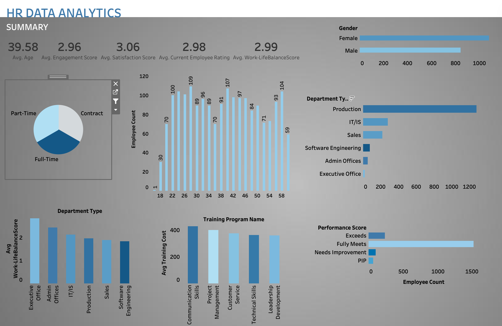

# My_Portfolio
Hi! I’m Anjana, an aspiring data analyst with a Master’s in Applied Statistics and strong skills in Python, SQL, Tableau, and AI technologies. I enjoy solving real-world problems through data storytelling and visualization.

---
**Languages:** Python, SQL,  
**Libraries:** Pandas, Numpy, Matplotlib, Scikit-learn, Seaborn  
**Visualization:** Tableau, Excel  
**Focus Areas:** EDA, Data Cleaning, Dashboarding, Machine Learning

---
Let's connect: www.linkedin.com/in/anjana-rajan-765245188

---
📊TABLEAU PROJECTS

HR Data Analytics

**Description**: This dashboard provides a comprehensive overview of key HR metrics to support data-driven decision-making in workforce management.
Key insights include:

👩‍💼 Employee Distribution:
Employee counts segmented by gender, department, employment type, and age groups.

⚖️ Work-Life Balance Comparison:
Visual comparison of work-life balance scores across different departments.

💰 Training Analysis:
Breakdown of training costs by type of training to monitor investment efficiency.

📈 Performance Scores Overview:
Count and distribution of employee performance scores.

📊 Summary Metrics:
Average age, engagement score, satisfaction score, employee rating, and work-life balance score summarized for quick insights.

This dashboard demonstrates my ability to transform complex HR data into actionable insights using interactive visualizations.

---
Inside the Vault: Banking Customer Behavior Dashboard

An interactive Tableau dashboard built using a banking dataset to explore customer demographics, account details, and behavioral patterns. The dashboard visualizes key metrics such as customer age, gender, credit score, tenure, and product usage to uncover insights that support strategic customer segmentation and engagement decisions.
